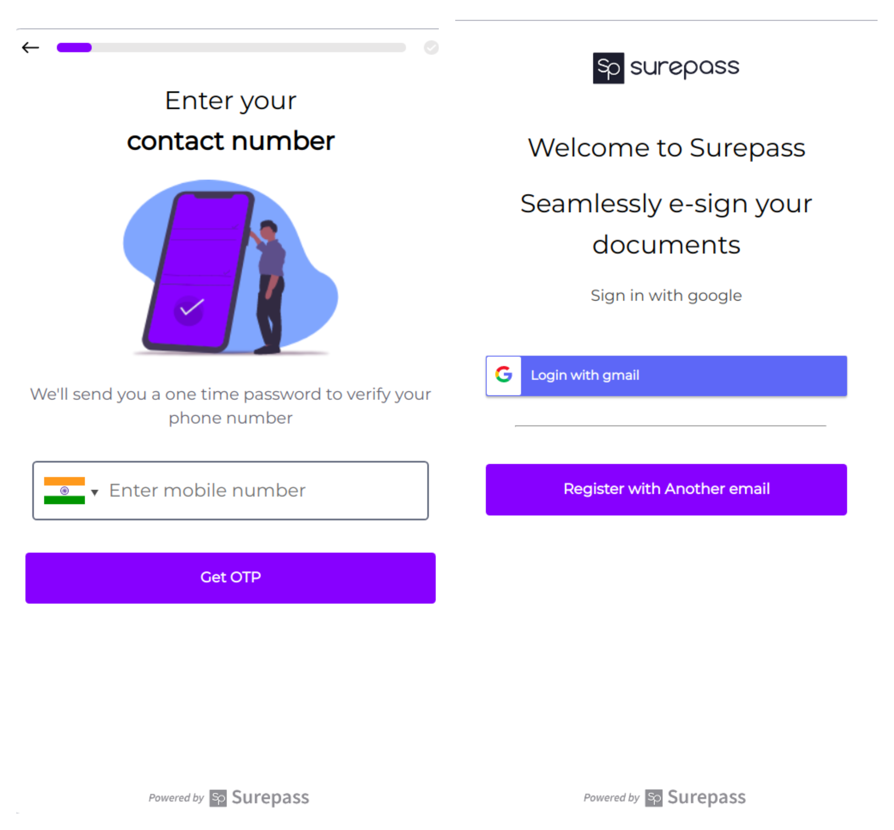

[](https://surepass.io/e-sign/)

SurePass eSign Web SDK lets you digitally sign documents easily using Aadhaar with basic and quick setup on your desired platform, be it mobile or web application.

## Basic Overview
SurePass eSign Web SDK provides a flexible option to integrate with your existing workflow. It can be consumed in two ways. You can add it to your flow of eSign and then expect a redirect at the url you passed while you were initializing the token. The other option is to use an event driven approach where you can initialize it in a new browser tab (for mobile devices and desktop) or in a new window (in desktop applications) and use the callback function to move forward based on success or failure of eSign.

## Table of Contents

- [SDK examples](#sdk-production-examples)
- [Installation](#installation)
- [Getting started](#getting-started)
    - [Using redirect process](#using-redirect)
    - [Using event based approach](#using-event-based-approach)
- [Basic SDK usage](#using-event-based-approach)
- [Handling the callback response](#handling-the-responses-in-callback)


## SDK Production Examples


## Installation

You can easily setup the SDK in your application using either of the following ways.

- **Install the eSign Web SDK as npm package.**

```shell script
$ npm i @surepass/esign
```

- **Directly embed the script tag in your application.**

```html
<script src="https://cdn.jsdelivr.net/gh/surepassio/aadhaar-esign-web-sdk@1.0.6/lib/eSignPopUp.min.js"></script>
```


## Getting Started
There are two ways you can integrate the web SDK into your flow.
- [Using the redirect process.](#using-redirect)
- [Using events based approach.](#using-event-based-approach)

### Using redirect
To use this method you need to initialize the token providing a redirect URL.

- Redirect the user to [SurePass eSign](https://esign-client.surepass.io/) with token in the query string which looks similar to `https://esign-client.surepass.io/?token=YOUR_TOKEN`.
- On successful completion of eSign we will redirect the user to your provided redirect URL.

**Note:** Using this approach doesn't require our supplementary package or script to be setup.


### Using event based approach
Specifying redirect URL while initializing token is completely optional. If this parameter is skipped, SurePass Web eSign follows event based approach.

- Make the token initialization without specifying any redirect URL. 
- You may optionally use our supplementary package or make one for yourself to initiate the eSign window with a callback function that will return the eSign status. Either success or failure along with a brief message.


### Basic Usage

Following example opens a new window or tab depending on the device being used either desktop or mobile. Finally, it invokes `onSuccess` or `onError` functions depending on the status of the eSign process.

```jsx
import React from "react"; 
import "./styles.css";
import { OpenEsignPopUP } from "@surepass/esign";

function openEsign(onSuccess, onError) {
  const token = 123;
  const options = {
    token,
    window_name: "Surepass",
    dimension: { width: "450", height: "850" }
  };
  const esign = new OpenEsignPopUP(options);
  esign.openWindow(onSuccess, onError);
}

function onSuccess(response) {
  console.log("Response", response);
}

function onError(response) {
  console.log("Error", response);
}

export default function App() {
  return (
    <div className="App">
      <button onClick={() => openEsign(onSuccess, onError)}>Call</button>
    </div>
  );
}
```

[](https://codesandbox.io/s/beautiful-gates-5kgk6?fontsize=14&hidenavigation=1&theme=dark)


### Handling the responses in callback

SurePass eSign returns following response depending on the status of eSign process.

**Note:** Only the **200 SUCCESS** status is sent to `onSuccess` function. Rest, all the other responses are dispatched to the `onError` function.

- #### 200 SUCCESS

Returns HTTP status of 200 OK, when the eSign process has been completed successfully.

```json
{
    "data": {
        "error": "SUCCESS"
    },
    "status_code": 200,
    "message": "successfully e-sign the document",
    "success": true
}
```

- #### 401 UNAUTHORIZED ACCESS

```json
{
    "data": {
        "error": "UNAUTH_ACCESS"
    },
    "status_code": 401,
    "message": "Invalid Token ",
    "success": false
}
```

- #### 403 MAXIMUM RETRY REACHED

```json
{
    "data": {
        "error": "MAX_RETRY"
    },
    "status_code": 403,
    "message": "The message about the possible cause. Due to phone number or OTPs.", 
    "success": false
}
```

- #### 422 USER REFUSAL TO VERIFY DOCUMENT

```json
{
    "data": {
        "error": "VERIFY_REFUSAL"
    },
    "status_code": 422,
    "message": "User refused to verify the document",
    "success": false
}
```

- #### 433 POPUP CLOSED BY USER

```json
{
    "data": {
        "error": "POPUP_CLOSED"
    },
    "status_code":433,
    "message": "User closed the popup window before process completed",
    "success": false
}
```

- #### 450 UNKNOWN ERROR

```json
{
    "data": {
        "error": "UNKNOWN_ERROR"
    },
    "status_code": 450,
    "message": "An error occurred",
    "success": false
}
```

- #### 500 INTERNAL SERVER ERROR

```json
{
    "data": {
        "error": "INT_SERVER_ERROR"
    },
    "status_code": 500,
    "message": "Internal server error occurred",
    "success": false
}
```

- #### 501 ERROR FROM NDLS

```json
{
      "data": {
          "error": "NDLS_ERROR"
      },
      "status_code": 501,
      "message": "error from ndls while signing document",
      "success": false
}
```

> All these messages are sent from the eSign window using `Widow.postMessage` function of javascript except the message of popup closure by user that we infer programmatically. So, you can design your own utility code based on [index.js](/src/eSignPopUp.js) to get the message from the child window or tab that your application will open.
